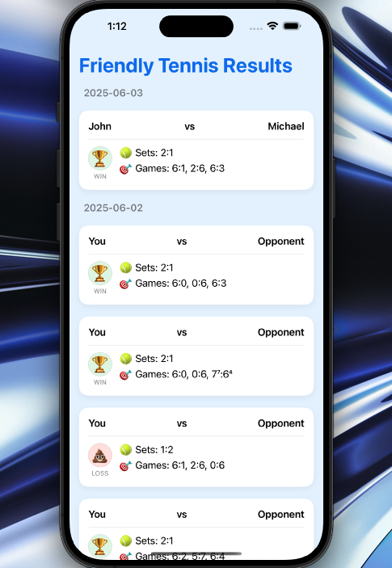
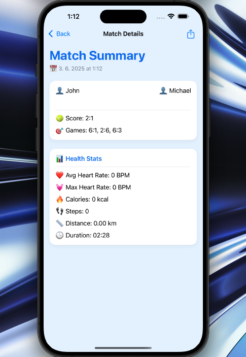
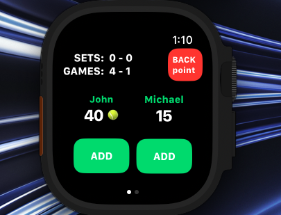
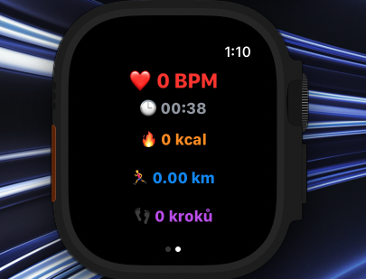
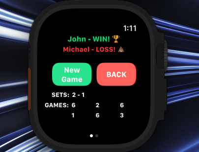

# Friendly Tennis

## Popis aplikace
Friendly Tennis je pokročilá nativní aplikace pro **iPhone a Apple Watch**, napsaná ve Swiftu pomocí SwiftUI. Umožňuje uživatelům pohodlně zaznamenávat výsledky tenisových zápasů (dvouhry i čtyřhry), synchronizovat data mezi zařízeními v reálném čase a zobrazovat zdravotní statistiky z HealthKit.

Aplikace propojuje Apple Watch s iPhonem pomocí `WatchConnectivity`, uchovává historii zápasů, odesílá lokální notifikace a podporuje export výsledků do snímku obrazovky pro sdílení.

## Klíčové funkce
- Zaznamenávání tenisových zápasů v reálném čase (single/double).
- Podpora klasického i super-tiebreaku, rotace podání.
- Historie zápasů s podrobnými statistikami.
- Zdravotní metriky: srdeční tep, kalorie, kroky, vzdálenost, čas trvání zápasu.
- Sdílení výsledku jako grafický snímek.
- Synchronizace zápasů mezi Watch ↔ iPhone.
- Lokální notifikace při přijetí nového zápasu.
- Data jsou ukládána lokálně pomocí `UserDefaults` + enkodování do JSON.

## Použité technologie a knihovny
- Swift & SwiftUI
- watchOS + iOS
- WatchConnectivity
- HealthKit
- UserNotifications
- Combine + MVVM architektura

## Struktura projektu
- `ContentView.swift` – hlavní obrazovka s historií zápasů (iPhone).
- `GameView.swift` – hra samotná na Apple Watch.
- `HealthTracker.swift` – sledování srdečního tepu, kalorií, kroků, vzdálenosti.
- `MatchDetailView.swift` – detail zápasu včetně zdravotních dat.
- `WatchConnectivityManager.swift` – komunikace mezi Watch a iPhonem.
- `GameResult.swift` – model pro uložení výsledku zápasu.
- `GameResultsViewModel.swift` – řízení stavů a logiky na iOS.

## Co ukazuje aplikace
- Schopnost propojit watchOS s iOS.
- Práci s HealthKit a jeho integraci v reálné aplikaci.
- Reaktivní UI pomocí SwiftUI + Combine.
- Práci s úložištěm (JSON & UserDefaults).
- Pokročilý herní engine pro tenis s logikou bodů, setů a pravidel.
- Sdílení a notifikace z aplikace.

## Ukázky obrazovek

| iPhone: Historie zápasů | iPhone: Detail zápasu |
|-------------------------|-----------------------|
|  |  |

| Apple Watch: Zápas | Apple Watch: Zdravotní data | Apple Watch: Výsledek |
|-------------------|-----------------------------|------------------------|
|  |  |  |

## Vhodné pro
- Zaznamenávání skóre u rekreačních zápasů.
- Osobní tréninky a statistické sledování zátěže.

